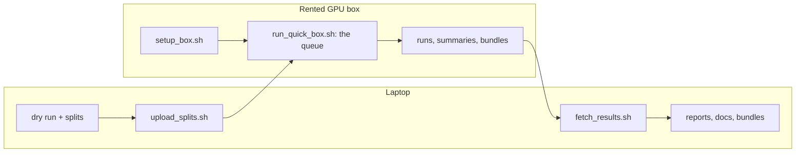

# 5. The quick-tier bake-off on a rented GPU box

!!! abstract "In plain words"
    You rent a powerful computer (a "box") for a few hours, the way you would rent a car. On it, recbench gives
    each of 23 low-budget methods the same tuning effort on every dataset. You bring the results home, and then
    you return the box so you stop paying. Expect about 30 minutes of setup, 1.5 to 2.5 hours per dataset, and
    $5 to $12 in total.

This step has four short parts. Do them in order. A fifth part, for a later session, finishes what a run left open.

| Part | What you do | Where | Time | Cost |
|---|---|---|---|---|
| [5a. Before you rent](box-1-before-you-rent.md) | a free dry run, the data splits, an account, an SSH key | laptop | ~1.5 h (mostly waiting) | $0 |
| [5b. Rent and set up](box-2-rent-and-set-up.md) | choose a machine, connect, install everything | laptop + box | ~30 min | ~$0.30 |
| [5c. Run and monitor](box-3-run-and-monitor.md) | copy the data, start the queue, watch it | box (watched from the laptop) | 1.5–2.5 h per dataset | ~$1–2 per dataset |
| [5d. Finish](box-4-finish.md) | bring the results home, check them, destroy the box | laptop | ~20 min | — |
| [5e. A follow-up session](box-5-follow-up.md) | later: re-run single jobs, finish confirmations, write bundles | laptop + box | 5–6 h | a few dollars |

## What runs on the box

| Word | Meaning |
|---|---|
| **Job** | One method on one dataset. It tries up to 10 settings on the validation fold `quick-val`, scoring the same 3,000 users each time, then runs the best setting **once** on the test split `quick`. A job never takes more than **3 hours**, its tuning included. |
| **Block** | All 23 jobs of one dataset. When the block ends, its top 3 methods by **validation** score are **confirmed** on the full data: the setting that depends on data size (for example EASE's λ) is re-checked on `full-val`, then the final test runs on `full`, three times with different seeds for methods whose training is random. The first confirmation run also writes a serving **bundle**, which [step 7](deploy-cloud-run.md) deploys. |
| **Order** | MovieLens-25M → RetailRocket → Steam → H&M → Last.fm. A worker that would otherwise wait starts the next dataset early ("backfill"). |

The words "fold", "confirmation" and "bundle" are in the [glossary](../dictionary/concepts/glossary.md). The rules
of the bake-off and the reasons behind them are on the [quick-tier page](../results/quick-tier.md).

!!! warning "Stopping is not enough"
    A *stopped* vast.ai instance still bills for its disk. When you are done, **destroy** it ([5d](box-4-finish.md)).

**Next:** [5a. Before you rent](box-1-before-you-rent.md).
